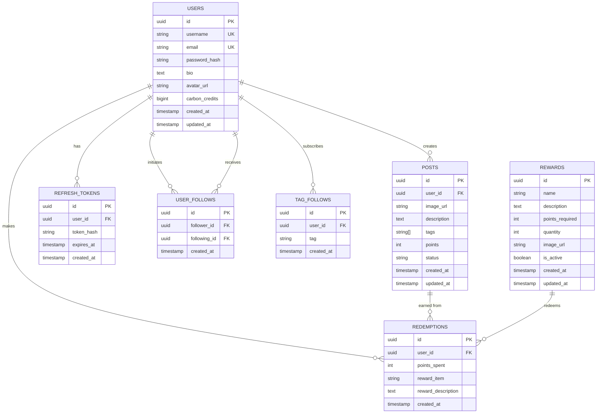

# ReLeaf Database ER Diagram

## Entity Relationship Diagram



## Table Relationships

### Core Tables

#### **USERS**
- Primary entity
- Stores user accounts, credentials, profile info, and credits balance
- **Constraints:**
  - `username` and `email` are unique
  - `carbon_credits` default is 0

#### **POSTS**
- User-generated eco-action posts
- **Foreign Keys:** `user_id` → USERS (CASCADE delete)
- **Status Values:** PENDING_POINTS, PUBLISHED, PENDING_RETRY, FAILED
- **Indexes:** user_id, status, created_at DESC, tags (GIN)

#### **REDEMPTIONS**
- Records of reward redemptions
- **Foreign Keys:** `user_id` → USERS (CASCADE delete)
- **Purpose:** Track points spent history and reward items claimed

#### **REFRESH_TOKENS**
- JWT token storage for authentication
- **Foreign Keys:** `user_id` → USERS (CASCADE delete)
- **Constraint:** `expires_at` timestamp for token validity
- **Index:** user_id, expires_at (for cleanup queries)

#### **REWARDS**
- Reward catalog available for redemption
- **Quantity:** -1 = unlimited, ≥0 = limited stock
- **is_active:** Toggle availability without deletion

### Social Graph Tables

#### **USER_FOLLOWS**
- Many-to-many: followers and following relationships
- **Foreign Keys:** 
  - `follower_id` → USERS
  - `following_id` → USERS
- **Constraints:**
  - UNIQUE(follower_id, following_id)
  - CHECK follower_id ≠ following_id (no self-follows)
- **Indexes:** follower_id, following_id

#### **TAG_FOLLOWS**
- User subscriptions to tags
- **Foreign Keys:** `user_id` → USERS (CASCADE delete)
- **Constraint:** UNIQUE(user_id, tag) - user can follow tag only once
- **Indexes:** user_id, tag

## Key Relationships

1. **One User → Many Posts** (1:N)
   - User creates posts
   - Posts deleted when user is deleted

2. **One User → Many Redemptions** (1:N)
   - User redeems rewards
   - Redemptions deleted when user is deleted

3. **One User → Many Refresh Tokens** (1:N)
   - Active sessions per user
   - Tokens deleted when user is deleted

4. **One Reward → Many Redemptions** (1:N)
   - Reward can be redeemed multiple times
   - Quantity decremented per redemption

5. **Many Users ↔ Many Users via USER_FOLLOWS** (M:N)
   - Social network graph
   - Bidirectional relationships possible but stored as separate records

6. **Many Users → Many Tags via TAG_FOLLOWS** (M:N)
   - User subscriptions to topics
   - Used for personalized feed filtering

## Indexes Created

```sql
-- Users
CREATE INDEX idx_users_username ON users(username);
CREATE INDEX idx_users_email ON users(email);

-- Posts
CREATE INDEX idx_posts_user_id ON posts(user_id);
CREATE INDEX idx_posts_status ON posts(status);
CREATE INDEX idx_posts_created_at ON posts(created_at DESC);
CREATE INDEX idx_posts_tags ON posts USING GIN(tags);

-- Redemptions
CREATE INDEX idx_redemptions_user_id ON redemptions(user_id);
CREATE INDEX idx_redemptions_created_at ON redemptions(created_at DESC);

-- Refresh Tokens
CREATE INDEX idx_refresh_tokens_user_id ON refresh_tokens(user_id);
CREATE INDEX idx_refresh_tokens_expires_at ON refresh_tokens(expires_at);

-- Rewards
CREATE INDEX idx_rewards_active ON rewards(is_active);
CREATE INDEX idx_rewards_points ON rewards(points_required);

-- User Follows
CREATE INDEX idx_user_follows_follower ON user_follows(follower_id);
CREATE INDEX idx_user_follows_following ON user_follows(following_id);

-- Tag Follows
CREATE INDEX idx_tag_follows_user ON tag_follows(user_id);
CREATE INDEX idx_tag_follows_tag ON tag_follows(tag);
```

## Database Views

### **user_stats**
Aggregate view for user statistics:
```
- user id, username
- total_posts (count)
- total_points_earned (sum from published posts)
- total_points_spent (sum from redemptions)
- current_carbon_credits
```

## Database Functions

### **redeem_reward()**
Stored procedure for atomic reward redemption:
- Validates user has sufficient credits
- Checks reward availability
- Deducts credits from user
- Decrements reward quantity
- Records redemption
- Transactional (all-or-nothing)
